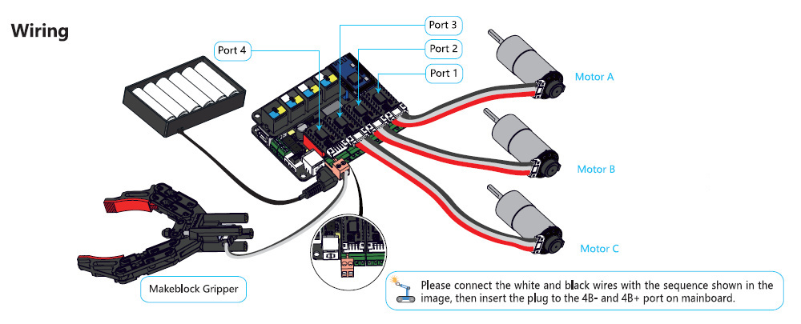

# Ruediger

Ruediger is the name of my Robot.
It is design to adapt the platform of the Makeblock robots to communicate with ROS

For this we will use the Arduino board from Makeblock : MegaPi and a Raspberry Pi

The aim is to control the Robot over ROS and to get all the information about the sensors over the Arduino

That is why there will be 2 folders
* arduino_ruediger
* raspi_ruediger

To build the Robot, I used the instructions of the Ultimate Robot 2.0 Detect Robot
You can watch them there : https://www.youtube.com/watch?v=8k3qfqbZZQA&ab_channel=Makeblock 

For the cabling I used the following connections:
Slot  | Motor
------------ | -------------
SLOT_1 | 25 mm DC Encoder Motor 9V/ 86RPM (Motor A)
SLOT_2 | 25 mm DC Encoder Motor 9V/185RPM (Motor B)
SLOT_3 | 25 mm DC Encoder Motor 9V/185RPM (Motor C)
SLOT_4 | Makeblock Gripper 



Port  | Sensor
------------ | -------------
PORT_5 | No Sensor
SLOT_6 | IMU
SLOT_7 | Ultrasonic Sensor
SLOT_8 | No Sensor


## Arduino_Ruediger

The Arduino part is there to gather all the sensors information and to move the Robot

What it can so far:

* Get data from the Makeblock Ultrason
* Get data from the Makeblock Inertial Motion Unit
* Get data from the Motor Encoders
* Move the Makeblock Motors

* Communicate over ROS Serial to a ROS Master


I used Platform IO combined to Visual Studio Code for ease of development please feel free to use whatever suits you most

## Raspi_Ruediger

The Raspberry Pi is setted up with ROS and comminicates with Arduino over serial


## Best Practices
### Use ubiquity
For ease of use, I decided to use the image from [Ubiquity]!https://downloads.ubiquityrobotics.com/pi.html

I can only highly recommand reading and following those tips : https://github.com/UbiquityRobotics/ubiquity_launches 

### Use VS Code / VS Code Insider
Develop over SSH with Visual Studio Code

https://www.hanselman.com/blog/VisualStudioCodeRemoteDevelopmentOverSSHToARaspberryPiIsButter.aspx
https://code.visualstudio.com/docs/remote/troubleshooting#_configuring-key-based-authentication

### Connect with ROS on a 3rd Computer
Use a Linux Computer with ROS installed - I use Ubuntu 16.04

Set up Ubuntu to connect to the Wifi of the the Robot
Export ROS_MASTER_URI to connect to the ROS of the Robot - you can also add it to your bashrc
```
export ROS_MASTER_URI=http://ruediger.local:11311
export ROS_IP=<your_ip_address_on_wifi> # export ROS_IP=10.42.0.130
```

### Use Teleop to command the Robot
```
git clone git@github.com:ros-teleop/teleop_twist_keyboard.git
cd teleop_twist_keyboard
. devel/setup.bash
rosrun teleop_twist_keyboard teleop_twist_keyboard.py cmd_vel:=/serial/cmd_vel _key_timeout:=0.6
```

### Command the Motor_1 and Motor_4
```
rostopic pub /serial/cmd_mot1 std_msgs/Int32 int 'data: 40'
rostopic pub /serial/cmd_mot4 std_msgs/Int32 int 'data: -40'
```
